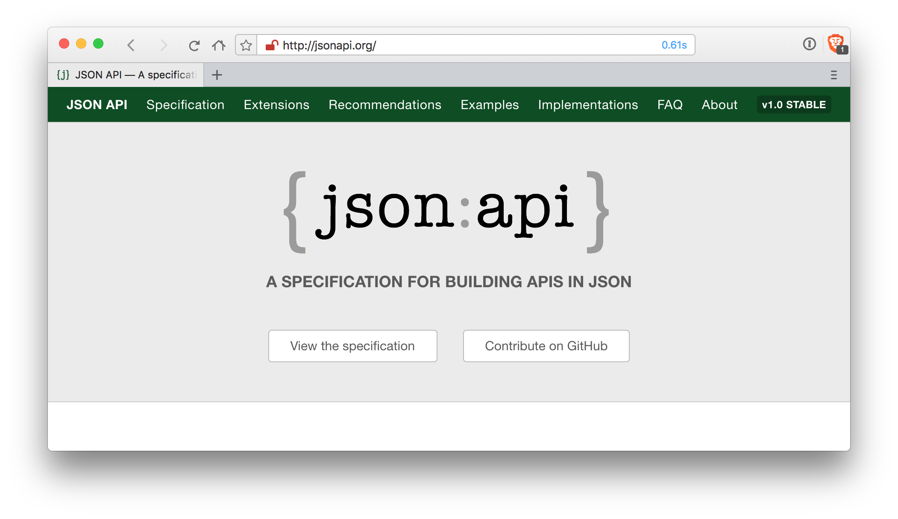

slidenumbers: false
slidecount:true
autoscale: false
build-lists: true

[.slidenumbers: false]
[.slidecount: false]
# [fit] _An Introduction to_
# [fit] { json:api }

---


# [fit] _Zhuo-Fei Hui_
# __@zfhui__
# Blinkist

^
- idea initiated at DaWanda
- taking ruby monoliths apart into micro services
- build 1st micro service with json-api specs
- that project should become a template for other micro services

---
## Problem

__RESTful APIs using JSON__
We don't have a shared understanding about the structure.

^
- snake case / camel case
- plural / singular
- endpoint design
- associations (links or embedding)
- resource nesting
- partial / complete update
- filters, sorting, meta info?
- variations of the same thing
- new client for every API
- BIKESHEDDING

---


## Problem

__Bikeshedding__
"Futile investment of time and energy in discussion of marginal technical issues."

_— Wiktionary_

<!-- ---
## Your Anti-Bikeshedding Tool


 -->
---

## { json:api }
### _A Specification for Building APIs in JSON_

<br/>

---
## { json:api }
### _A Specification for Building APIs in JSON_

How __a client__ should request for resources to be fetched or modified.

---
## { json:api }
### _A Specification for Building APIs in JSON_

How __a client__ should request for resources to be fetched or modified.
How __a server__ should respond to those requests.

---
## { json:api }

__Shared Conventions__
"By following (it), you can increase productivity, take advantage of generalized tooling, and focus on what matters: your application."
_— jsonapi.org_

^
- a group of people (Yahuda Katz, Steven Klabnik)

---
[.autoscale: true]
## Media Type

`Content-Type: application/vnd.api+json`

__Request Header__

```http
GET /users/1 HTTP/1.1
Accept: application/vnd.api+json
```

__Response Header__

```http
HTTP/1.1 200 OK
Content-Type: application/vnd.api+json
```

---
## A Simple Resource Object

<br/>

---
## A Simple Resource Object

```ruby
User(id: integer, name: string)
```

---
## Fetching a User

```ruby
User(id: integer, name: string)
```

`GET /users/1`

---
## Fetching a User

```ruby
User(id: integer, name: string)
```

`GET /users/1`

```json
{
  "data": {
    "id": "1",
    "type": "users",
    "attributes": { "name": "Steve Klabnik" }
  }
}
```

---
## Fetching a User

```ruby
User(id: integer, name: string)
```

`GET /users/1`

```json, [.highlight: 2, 6]
{
  "data": {
    "id": "1",
    "type": "users",
    "attributes": { "name": "Steve Klabnik" }
  }
}
```

^
`data`: the root

---
## Fetching a User

```ruby
User(id: integer, name: string)
```

`GET /users/1`

```json, [.highlight: 3-4]
{
  "data": {
    "id": "1",
    "type": "users",
    "attributes": { "name": "Steve Klabnik" }
  }
}
```

^
mandatory: identifier objects: ID, TYPE

---
## Fetching a User

```ruby
User(id: integer, name: string)
```

`GET /users/1`

```json, [.highlight: 5]
{
  "data": {
    "id": "1",
    "type": "users",
    "attributes": { "name": "Steve Klabnik" }
  }
}
```

^
optional

---
## Creating a User

`POST /users`

---
## Creating a User

`POST /users`

```json
{
  "data": {
    "type": "users",
    "attributes": { "name": "Yehuda Katz" }
  }
}
```

---
## Creating a User

`POST /users`

```json, [.highlight: 2, 5]
{
  "data": {
    "type": "users",
    "attributes": { "name": "Yehuda Katz" }
  }
}
```

---
## Creating a User

`POST /users`

```json, [.highlight: 3]
{
  "data": {
    "type": "users",
    "attributes": { "name": "Yehuda Katz" }
  }
}
```

---
## Creating a User

`POST /users`

```json, [.highlight: 4]
{
  "data": {
    "type": "users",
    "attributes": { "name": "Yehuda Katz" }
  }
}
```

---
## Getting a List of Users

`GET /users`

---

`GET /users`

```json
{
  "data": [
    {
      "id": "1",
      "type": "users",
      "attributes": { "name": "Steve Klabnik" }
    },
    {
      "id": "2",
      "type": "users",
      "attributes": { "name": "Yehuda Katz" }
    }
  ]
}
```

---
`GET /users`

```json, [.highlight: 2, 13]
{
  "data": [
    {
      "id": "1",
      "type": "users",
      "attributes": { "name": "Steve Klabnik" }
    },
    {
      "id": "2",
      "type": "users",
      "attributes": { "name": "Yehuda Katz" }
    }
  ]
}
```

---
`GET /users`

```json, [.highlight: 3-7]
{
  "data": [
    {
      "id": "1",
      "type": "users",
      "attributes": { "name": "Steve Klabnik" }
    },
    {
      "id": "2",
      "type": "users",
      "attributes": { "name": "Yehuda Katz" }
    }
  ]
}
```

---
`GET /users`

```json, [.highlight: 8-12]
{
  "data": [
    {
      "id": "1",
      "type": "users",
      "attributes": { "name": "Steve Klabnik" }
    },
    {
      "id": "2",
      "type": "users",
      "attributes": { "name": "Yehuda Katz" }
    }
  ]
}
```

---
## Updating a User

`PATCH /users/2`

```json
{
  "data": {
    "id": "2",
    "type": "users",
    "attributes": { "name": "Dan Gebhardt" }
  }
}
```

---
## Updating a User

`PATCH /users/2`

```json, [.highlight: 3]
{
  "data": {
    "id": "2",
    "type": "users",
    "attributes": { "name": "Dan Gebhardt" }
  }
}
```

^
specify the ID twice!

---
## Deleting a User

`DELETE /users/2`

^
We get a 204 back.

---
## 1:n Relationship

```ruby
User(id: integer, name: string)

Article(
  id: integer,
  title: string,
  content: text,
  user_id: integer
)
```

---
## Fetching a User

`GET /users/1`

---
`GET /users/1`

```json
{
  "data": {
    "id": "1",
    "type": "users",
    "attributes": { "name": "Steve Klabnik" },
    "relationships": {
      "articles": {
        "data": [
          { "id": "2", "type": "articles" },
          { "id": "5", "type": "articles" }
        ]
      }
    }
  }
}
```

---
`GET /users/1`

```json, [.highlight: 2-5]
{
  "data": {
    "id": "1",
    "type": "users",
    "attributes": { "name": "Steve Klabnik" },
    "relationships": {
      "articles": {
        "data": [
          { "id": "2", "type": "articles" },
          { "id": "5", "type": "articles" }
        ]
      }
    }
  }
}
```

---
`GET /users/1`

```json, [.highlight: 6-13]
{
  "data": {
    "id": "1",
    "type": "users",
    "attributes": { "name": "Steve Klabnik" },
    "relationships": {
      "articles": {
        "data": [
          { "id": "2", "type": "articles" },
          { "id": "5", "type": "articles" }
        ]
      }
    }
  }
}
```

---
`GET /users/1`

```json, [.highlight: 6, 13]
{
  "data": {
    "id": "1",
    "type": "users",
    "attributes": { "name": "Steve Klabnik" },
    "relationships": {
      "articles": {
        "data": [
          { "id": "2", "type": "articles" },
          { "id": "5", "type": "articles" }
        ]
      }
    }
  }
}
```
---
`GET /users/1`

```json, [.highlight: 7, 12]
{
  "data": {
    "id": "1",
    "type": "users",
    "attributes": { "name": "Steve Klabnik" },
    "relationships": {
      "articles": {
        "data": [
          { "id": "2", "type": "articles" },
          { "id": "5", "type": "articles" }
        ]
      }
    }
  }
}
```
---
`GET /users/1`

```json, [.highlight: 8-11]
{
  "data": {
    "id": "1",
    "type": "users",
    "attributes": { "name": "Steve Klabnik" },
    "relationships": {
      "articles": {
        "data": [
          { "id": "2", "type": "articles" },
          { "id": "5", "type": "articles" }
        ]
      }
    }
  }
}
```

^
If we are interested in the articles, we can GET each article respectively

---
`GET /articles/2`

```json
{
  "data": {
    "id": "2",
    "type": "articles",
    "attributes": {
      "title": "Intro to JSON API",
      "content": "Lorem opossum ..."
    },
    "relationships": {
      "user": {
        "data": { "id": "1", "type": "users" }
      }
    }
  }
}
```

---
`GET /articles/5`

```json
{
  "data": {
    "id": "5",
    "type": "articles",
    "attributes": {
      "title": "Anti-Bikeshedding",
      "content": "Marsupial fur trees ..."
    },
    "relationships": {
      "user": {
        "data": { "id": "1", "type": "users" }
      }
    }
  }
}
```

---
[.autoscale: true]
## Compound Documents

- __Instead of 3 requests:__
- `GET /users/1`
- `GET /articles/2` __and__ `GET /articles/5`
- __We can do 1 request:__
- `GET /users/1?include=articles`

^
- to reduce number of requests

---
`GET /users/1?include=articles`

```json
{
  "data": {
    "id": "1",
    "type": "users",
    "attributes": { "name": "Steve Klabnik" },
    "relationships": {
      "articles": {
        "data": [
          { "id": "2", "type": "articles" },
          { "id": "5", "type": "articles" }
        ]
      }
    },
    "included": [
      {
        "id": "2",
        "type": "articles",
        "attributes": { "title": "Intro to JSON API", "content": "Lorem opossum ..." }
      },
      {
        "id": "5",
        "type": "articles",
        "attributes": { "title": "Anti-Bikeshedding", "content": "Marsupial fur trees ..." }
      }
    ]
  }
}
```

---
`GET /users/1?include=articles`

```json, [.highlight: 2-13]
{
  "data": {
    "id": "1",
    "type": "users",
    "attributes": { "name": "Steve Klabnik" },
    "relationships": {
      "articles": {
        "data": [
          { "id": "2", "type": "articles" },
          { "id": "5", "type": "articles" }
        ]
      }
    },
    "included": [
      {
        "id": "2",
        "type": "articles",
        "attributes": { "title": "Intro to JSON API", "content": "Lorem opossum ..." }
      },
      {
        "id": "5",
        "type": "articles",
        "attributes": { "title": "Anti-Bikeshedding", "content": "Marsupial fur trees ..." }
      }
    ]
  }
}
```

---
`GET /users/1?include=articles`

```json, [.highlight: 14-25]
{
  "data": {
    "id": "1",
    "type": "users",
    "attributes": { "name": "Steve Klabnik" },
    "relationships": {
      "articles": {
        "data": [
          { "id": "2", "type": "articles" },
          { "id": "5", "type": "articles" }
        ]
      }
    },
    "included": [
      {
        "id": "2",
        "type": "articles",
        "attributes": { "title": "Intro to JSON API", "content": "Lorem opossum ..." }
      },
      {
        "id": "5",
        "type": "articles",
        "attributes": { "title": "Anti-Bikeshedding", "content": "Marsupial fur trees ..." }
      }
    ]
  }
}
```

---
`GET /users/1?include=articles`

```json, [.highlight: 14, 25]
{
  "data": {
    "id": "1",
    "type": "users",
    "attributes": { "name": "Steve Klabnik" },
    "relationships": {
      "articles": {
        "data": [
          { "id": "2", "type": "articles" },
          { "id": "5", "type": "articles" }
        ]
      }
    },
    "included": [
      {
        "id": "2",
        "type": "articles",
        "attributes": { "title": "Intro to JSON API", "content": "Lorem opossum ..." }
      },
      {
        "id": "5",
        "type": "articles",
        "attributes": { "title": "Anti-Bikeshedding", "content": "Marsupial fur trees ..." }
      }
    ]
  }
}
```

---
`GET /users/1?include=articles`

```json, [.highlight: 15-19]
{
  "data": {
    "id": "1",
    "type": "users",
    "attributes": { "name": "Steve Klabnik" },
    "relationships": {
      "articles": {
        "data": [
          { "id": "2", "type": "articles" },
          { "id": "5", "type": "articles" }
        ]
      }
    },
    "included": [
      {
        "id": "2",
        "type": "articles",
        "attributes": { "title": "Intro to JSON API", "content": "Lorem opossum ..." }
      },
      {
        "id": "5",
        "type": "articles",
        "attributes": { "title": "Anti-Bikeshedding", "content": "Marsupial fur trees ..." }
      }
    ]
  }
}
```

---
`GET /users/1?include=articles`

```json, [.highlight: 20-24]
{
  "data": {
    "id": "1",
    "type": "users",
    "attributes": { "name": "Steve Klabnik" },
    "relationships": {
      "articles": {
        "data": [
          { "id": "2", "type": "articles" },
          { "id": "5", "type": "articles" }
        ]
      }
    },
    "included": [
      {
        "id": "2",
        "type": "articles",
        "attributes": { "title": "Intro to JSON API", "content": "Lorem opossum ..." }
      },
      {
        "id": "5",
        "type": "articles",
        "attributes": { "title": "Anti-Bikeshedding", "content": "Marsupial fur trees ..." }
      }
    ]
  }
}
```
^
- if you are not interested in all of articles attributes
- e.g. show a list of user's articles = titles
- JSON API allows you to only include titles

---
`GET /users/1?include=articles`

```json, [.highlight: 18, 23]
{
  "data": {
    "id": "1",
    "type": "users",
    "attributes": { "name": "Steve Klabnik" },
    "relationships": {
      "articles": {
        "data": [
          { "id": "2", "type": "articles" },
          { "id": "5", "type": "articles" }
        ]
      }
    },
    "included": [
      {
        "id": "2",
        "type": "articles",
        "attributes": { "title": "Intro to JSON API", "content": "Lorem opossum ..." }
      },
      {
        "id": "5",
        "type": "articles",
        "attributes": { "title": "Anti-Bikeshedding", "content": "Marsupial fur trees ..." }
      }
    ]
  }
}
```
^
- if you are not interested in all of articles attributes
- e.g. show a list of user's articles = titles
- JSON API allows you to only include titles

---
`GET /users/1?include=articles.title`

```json, [.highlight: 18, 23]
{
  "data": {
    "id": "1",
    "type": "users",
    "attributes": { "name": "Steve Klabnik" },
    "relationships": {
      "articles": {
        "data": [
          { "id": "2", "type": "articles" },
          { "id": "5", "type": "articles" }
        ]
      }
    },
    "included": [
      {
        "id": "2",
        "type": "articles",
        "attributes": { "title": "Intro to JSON API" }
      },
      {
        "id": "5",
        "type": "articles",
        "attributes": { "title": "Anti-Bikeshedding" }
      }
    ]
  }
}
```

---
## Fetching User's Relationships

`GET /users/1/relationships/articles`

```json
{
  "data": [
    { "id": "2", "type": "articles" },
    { "id": "5", "type": "articles" }
  ]
}
```

---
## Creating a User with Relationships

`POST /users`

---
`POST /users`

```json, [.highlight: 5-12]
{
  "data": {
    "type": "users",
    "attributes": { "name": "Steve Klabnik" },
    "relationships": {
      "articles": {
        "data": [
          { "id": "2", "type": "articles" },
          { "id": "5", "type": "articles" }
        ]
      }
    }
  }
}
```

^
* when referred articles already exist
* creating more than one resource with one POST request is currently not suported
* but [will be supported in the future](https://github.com/json-api/json-api/issues/795)

---

## Adding Relationships to a User

`POST /users/1/relationships/articles`

```json
{
  "data": [
    { "id": "4", "type": "articles" },
    { "id": "6", "type": "articles" }
  ]
}
```

---
## Updating a User

`PUT /users/1`

#☝️

__"relationships" field replaces relationships completely!__

---

☝️ `PUT /users/1`

```json, [.highlight: 6-13]
{
  "data": {
    "id": "1",
    "type": "users",
    "attributes": { "name": "Dan Gebhardt" },
    "relationships": {
      "articles": {
        "data": [
          { "id": "3", "type": "articles" },
          { "id": "6", "type": "articles" }
        ]
      }
    }
  }
}
```
---

☝️ `PUT /users/1`

```json, [.highlight: 6-13]
{
  "data": {
    "id": "1",
    "type": "users",
    "attributes": { "name": "Dan Gebhardt" },
    "relationships": {
      "articles": {
        "data": []
      }
    }
  }
}
```

^
Empties all relationships to articles.

---

`PUT /users/1`

```json
{
  "data": {
    "id": "1",
    "type": "users",
    "attributes": { "name": "Dan Gebhardt" }
  }
}
```

---
## Updating To-One Relationship

`PUT /articles/5/relationships/user`

---
## Replace To-One Relationship

`PUT /articles/5/relationships/user`

```json
{
  "data": { "id": "3", "type": "users" }
}
```

```http
HTTP/1.1 204 No Content
```

---
## Remove To-One Relationship

`PUT /articles/5/relationships/user`


```json
{
  "data": null
}
```

```http
HTTP/1.1 422 Unprocessable Entity
Content-Type: application/vnd.api+json
```
---
## Updating To-Many Relationship

`PUT /users/1/relationships/articles`

---
## Replace To-Many Relationships

`PUT /users/1/relationships/articles`

```json
{
  "data": { "id": "3", "type": "articles" },
  "data": { "id": "7", "type": "articles" },
}
```

```http
HTTP/1.1 403 Forbidden
```

^
```json
{
  "errors": [
    {
      "title": "Complete replacement forbidden",
      "detail": "Complete replacement forbidden for this relationship",
      "code": "FORBIDDEN",
      "status": "403"
    }
  ]
}
```

---
## Remove To-Many Relationship

`PUT /users/1/relationships/articles`


```json
{
  "data": []
}
```

```http
HTTP/1.1 403 Forbidden
```

^
```
{
  "errors": [
    {
      "title": "Complete replacement forbidden",
      "detail": "Complete replacement forbidden for this relationship",
      "code": "FORBIDDEN",
      "status": "403"
    }
  ]
}
```

---
## Deleting a User's Relationships

`DELETE /users/1/relationships/articles`

```json
{
  "data": [
    { "id": "2", "type": "articles"},
    { "id": "5", "type": "articles"},
    { "id": "9", "type": "articles"}
  ]
}
```

---
[.autoscale: true]
## Things we didn't discuss

* __-__ error objects, meta objects, links objects, pagination, versioning, ...
* __-__ n:m relationships
* __-__ creating a nested resource
* __-__ ...

^

---

## __Implementation__
## [fit] _with_ JSONAPI::Resources

---
[.autoscale: true]
## Create your new Rails API

- `rails new my-new-json-api --api`
- `rails g scaffold user name:string`
- `rails g scaffold article title:string content:text`
- `rails db:setup`
- Add `gem "jsonapi-resource"` to your Gemfile
- `bundle install`

---
## gem "jsonapi-resources"

```shell
rails g jsonapi:resource user
  create  app/resources/user_resource.rb
```

```ruby
class UserResource < JSONAPI::Resource; end
```

```
rails g jsonapi:resource article
  create  app/resources/user_resource.rb
```

```ruby
class ArticleResource < JSONAPI::Resource; end
```

---
`GET /users/1`

```json
{
  "data": {
    "id": "1",
    "type": "users",
    "attributes": { "name": "Steven Klabnik" }
  }
}
```

```ruby
# app/resources/user_resource.rb

class UserResource < JSONAPI::Resource
  attribute :name
end
```

---

```ruby
# config/routes.rb


Rails.application.routes.draw do
  # resources :articles
  # resources :users

  jsonapi_resources :articles
  jsonapi_resources :users
end
```

---

## Versioning

JSON API is stricly additive

---
## Authorization

---
## Testing

---
[.autoscale: true]
## History

- __2013-05-03__ Yehuda Katz released initial draft
- __2013-07-21__ media type registration with IANA completed
- __2014-07-05__ `v1.0rc` released
- __2015-05-29__ `v1.0stable` released
- __Today__ `v1.1` still in draft

^
- Katz was building a generic Ember API client
- IANA: International Assigned Numbers Authority
- 3 yrs old specification
- maintainers: Steve Klabnik / Yehuda Katz / Dan Gebhard
- all have backgrounds in Rails
- @jsonapi: <300 tweets

---
## References

- __Talk__ ["The JSON API Spec" by Marco Otto-Witte](https://www.youtube.com/watch?v=RSv-Yv3cgPg)

---
## json:api vs GraphQL

- GraphQL is protocol agnostic
- JSON API leverages HTTP functionalities, such as:

---
## json:api vs GraphQL

```
GET /users/1` HTTP/1.1
Accept: application/vnd.api+json
```

```
HTTP/1.1 200 OK
Content-Type: application/vnd.api+json
ETag: "bf3291afe28105e12b9ff5941a3cf6d7"
```

---
## json:api vs GraphQL

```
GET /users/1` HTTP/1.1
Accept: application/vnd.api+json
If-None-Match: "bf3291afe28105e12b9ff5941a3cf6d7"
```

```
HTTP/1.1 305 Not Modified
```

^
* HTTP caching mechanism
* with HTTP/2: more parallel requests, server push, ...
